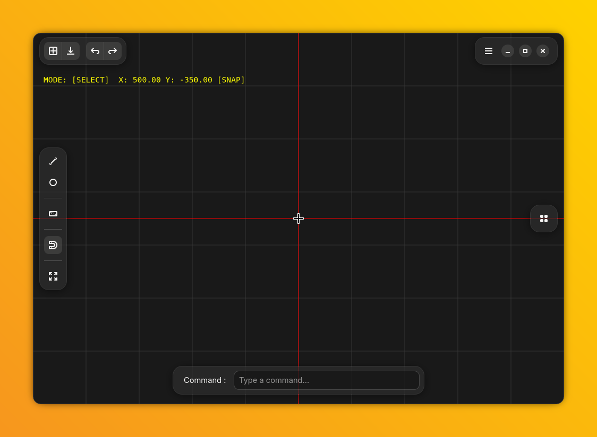

# Drafting

A simple 2D CAD application for Linux, built with GTK4 and libadwaita.



## Features

- Draw lines, circles, and linear dimensions
- Grid snapping with adaptive LOD grid
- Multi-tab support
- Rectangular array with animated preview
- Multi-select with window/crossing selection (AutoCAD-style)
- Move tool with snap
- Undo/Redo
- Command bar interface
- DXF export
- Auto-pan at window edges

## Installation

### Linux (Flatpak) — Recommended

```sh
flatpak install com.pungpondsalami.drafting
```

> Flatpak is the primary supported platform.

### Windows (MSIX) — Developer Preview

Windows builds are available as MSIX packages via [GitHub Actions](https://github.com/pungpondsalami/Drafting/actions).

Since the package is self-signed, you'll need to install the certificate first.
See [installation guide](docs/Steps_for_installing_Drafting_on_the_Windows_developer_version.pdf) for step-by-step instructions.

## Building from Source

### Requirements

- Rust (stable)
- GTK4 ≥ 4.12
- libadwaita ≥ 1.4
- Meson + Ninja

### Build

```sh
meson setup build
ninja -C build
ninja -C build install
```

Or for development:

```sh
cargo build
cargo run
```

## Keyboard Shortcuts

| Key | Action |
|---|---|
| `L` | Line tool |
| `C` | Circle tool |
| `S` | Select mode |
| `Z` | Zoom to cursor |
| `Ctrl+F` | Zoom to fit |
| `Ctrl+Z` | Undo |
| `F9` | Toggle snap |
| `Esc` | Cancel / back to select |

## Command Bar

Type commands in the command bar at the bottom:

| Command | Action |
|---|---|
| `l`, `line` | Line tool |
| `c`, `circle` | Circle tool |
| `ar`, `array` | Rectangular array |
| `fit` | Zoom to fit |
| `z` | Zoom in at cursor |
| `u`, `undo` | Undo |
| `save` | Save as DXF |

## License

GPL-3.0-or-later © 2026 Supakit Suptorranee
